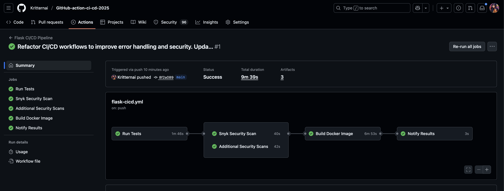

# GitHub Actions CI/CD Pipeline Project

**กฤตนัย บุญน้อย 6703001**

## 📊 ผลการทดลอง

### Lab 1: Docker Compose


### Lab 2: Flask CI/CD Pipeline


## ❓ คำถามท้ายการทดลอง

**คำถาม 1: docker compose คืออะไร มีความสำคัญอย่างไร**
- **คำตอบ**: Docker Compose เป็นเครื่องมือที่ใช้จัดการ containers หลายตัวพร้อมกัน ใช้ไฟล์ YAML กำหนด services, networks, volumes ทำให้ deploy และจัดการ containers ง่ายขึ้น มีความสำคัญในการพัฒนา microservices

**คำถาม 2: GitHub pipeline คืออะไร เกี่ยวข้องกับ CI/CD อย่างไร**
- **คำตอบ**: GitHub Actions pipeline เป็นระบบ automation ที่ช่วยใน CI/CD โดยรัน automated tests, security scans, builds และ deployments เมื่อ push code หรือ pull request ทำให้ตรวจสอบคุณภาพ code และ deploy อัตโนมัติ

**คำถาม 3: จากไฟล์ docker compose ส่วนของ volumes networks และ healthcheck มีความสำคัญอย่างไร**
- **คำตอบ**: 
  - **Volumes**: เก็บข้อมูลถาวรของ database และ cache ไม่ให้ข้อมูลหายเมื่อ container restart
  - **Networks**: สร้าง network แยกให้ services สื่อสารกันได้อย่างปลอดภัย
  - **Healthcheck**: ตรวจสอบสถานะ services ให้แน่ใจว่า services พร้อมใช้งานก่อนที่ services อื่นจะเชื่อมต่อ

**คำถาม 4: อธิบาย Code ของไฟล์ yaml ในส่วนนี้**
```yaml
jobs:
  test:
    name: Run Tests
    runs-on: ubuntu-latest
    
    services:
      postgres:
        image: postgres:16-alpine
        env:
          POSTGRES_PASSWORD: testpass
          POSTGRES_USER: testuser
          POSTGRES_DB: testdb
        ports:
          - 5432:5432
        options: >-
          --health-cmd "pg_isready -U testuser"
          --health-interval 10s
          --health-timeout 5s
          --health-retries 5
```
- **คำตอบ**: ส่วนนี้กำหนด test job ที่รันบน Ubuntu และสร้าง PostgreSQL service สำหรับ testing โดย services กำหนด PostgreSQL service สำหรับ test database, env ตั้งค่า environment variables, ports mapping port 5432, options กำหนด health check รอจนกว่า database พร้อม

**คำถาม 5: จาก Code ในส่วนของ uses: actions/checkout@v4 และ uses: actions/setup-python@v5 คืออะไร**
```yaml
steps:
  - name: Checkout code
    uses: actions/checkout@v4

  - name: Set up Python
    uses: actions/setup-python@v5
    with:
      python-version: ${{ env.PYTHON_VERSION }}
      cache: 'pip'
```
- **คำตอบ**: 
  - **actions/checkout@v4**: action ที่ใช้ checkout code จาก repository มาไว้ใน runner
  - **actions/setup-python@v5**: action ที่ใช้ติดตั้ง Python environment พร้อม cache pip dependencies เพื่อเพิ่มความเร็วในการติดตั้ง packages

**คำถาม 6: Snyk คืออะไร มีความสามารถอย่างไรบ้าง**
- **คำตอบ**: Snyk เป็น security platform ที่มีความสามารถ:
  - **Dependency Scanning**: ตรวจสอบ vulnerabilities ใน dependencies
  - **Code Scanning**: ตรวจสอบ security issues ใน source code
  - **Container Scanning**: ตรวจสอบ vulnerabilities ใน Docker images
  - **Infrastructure as Code**: ตรวจสอบ security issues ใน IaC files
  - **License Compliance**: ตรวจสอบ license compliance
  - **Fix Suggestions**: แนะนำวิธีแก้ไข security issues
