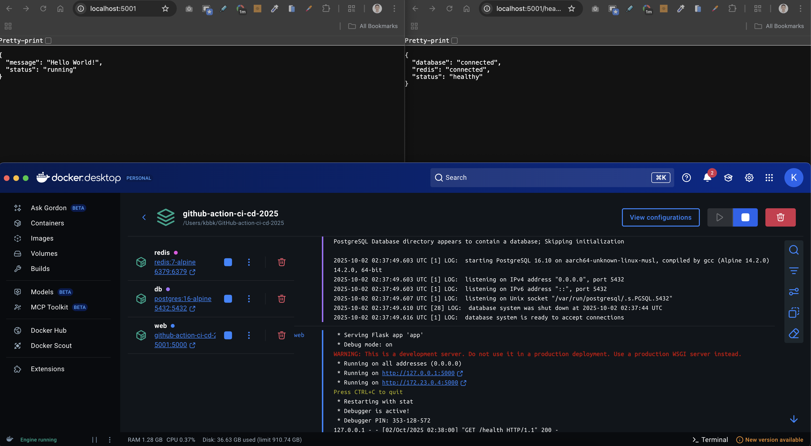

# GitHub Actions CI/CD Pipeline Project

**กฤตนัย บุญน้อย 6703001**

## 📊 ผลการทดลอง

### Lab 1: Docker Compose


### Lab 2: Flask CI/CD Pipeline


## ❓ คำถามท้ายการทดลอง

**คำถาม 1: docker compose คืออะไร มีความสำคัญอย่างไร**
- **คำตอบ**: Docker Compose เป็นเครื่องมือสำหรับจัดการ multi-container applications โดยใช้ไฟล์ YAML ในการกำหนด services, networks, volumes และ environment variables ทำให้สามารถ deploy และจัดการ containers หลายตัวพร้อมกันได้ง่ายขึ้น มีความสำคัญในการพัฒนา microservices และการจัดการ dependencies ระหว่าง services

**คำถาม 2: GitHub pipeline คืออะไร เกี่ยวข้องกับ CI/CD อย่างไร**
- **คำตอบ**: GitHub Actions pipeline เป็นระบบ automation ที่ช่วยในการ Continuous Integration/Continuous Deployment (CI/CD) โดยสามารถรัน automated tests, security scans, builds และ deployments เมื่อมีการ push code หรือ pull request ทำให้สามารถตรวจสอบคุณภาพ code และ deploy ได้อย่างอัตโนมัติ

**คำถาม 3: จากไฟล์ docker compose ส่วนของ volumes networks และ healthcheck มีความสำคัญอย่างไร**
- **คำตอบ**: 
  - **Volumes**: ใช้เก็บข้อมูลถาวรของ database และ cache เพื่อไม่ให้ข้อมูลหายเมื่อ container restart
  - **Networks**: สร้าง isolated network ให้ services สื่อสารกันได้อย่างปลอดภัย
  - **Healthcheck**: ตรวจสอบสถานะของ services เพื่อให้แน่ใจว่า services พร้อมใช้งานก่อนที่ services อื่นจะเชื่อมต่อ

**คำถาม 4: อธิบาย Code ของไฟล์ yaml ในส่วนนี้**
```yaml
jobs:
  test:
    name: Run Tests
    runs-on: ubuntu-latest
    
    services:
      postgres:
        image: postgres:16-alpine
        env:
          POSTGRES_PASSWORD: testpass
          POSTGRES_USER: testuser
          POSTGRES_DB: testdb
        ports:
          - 5432:5432
        options: >-
          --health-cmd "pg_isready -U testuser"
          --health-interval 10s
          --health-timeout 5s
          --health-retries 5
```
- **คำตอบ**: ส่วนนี้เป็นการกำหนด test job ที่รันบน Ubuntu และสร้าง PostgreSQL service สำหรับ testing โดย:
  - **services**: กำหนด PostgreSQL service สำหรับ test database
  - **env**: ตั้งค่า environment variables สำหรับ database
  - **ports**: mapping port 5432 สำหรับเชื่อมต่อ database
  - **options**: กำหนด health check เพื่อรอจนกว่า database จะพร้อม

**คำถาม 5: จาก Code ในส่วนของ uses: actions/checkout@v4 และ uses: actions/setup-python@v5 คืออะไร**
```yaml
steps:
  - name: Checkout code
    uses: actions/checkout@v4

  - name: Set up Python
    uses: actions/setup-python@v5
    with:
      python-version: ${{ env.PYTHON_VERSION }}
      cache: 'pip'
```
- **คำตอบ**: 
  - **actions/checkout@v4**: เป็น action ที่ใช้ checkout code จาก repository มาไว้ใน runner
  - **actions/setup-python@v5**: เป็น action ที่ใช้ติดตั้ง Python environment พร้อม cache pip dependencies เพื่อเพิ่มความเร็วในการติดตั้ง packages

**คำถาม 6: Snyk คืออะไร มีความสามารถอย่างไรบ้าง**
- **คำตอบ**: Snyk เป็น security platform ที่มีความสามารถ:
  - **Dependency Scanning**: ตรวจสอบ vulnerabilities ใน dependencies
  - **Code Scanning**: ตรวจสอบ security issues ใน source code
  - **Container Scanning**: ตรวจสอบ vulnerabilities ใน Docker images
  - **Infrastructure as Code**: ตรวจสอบ security issues ใน IaC files
  - **License Compliance**: ตรวจสอบ license compliance
  - **Fix Suggestions**: แนะนำวิธีแก้ไข security issues
